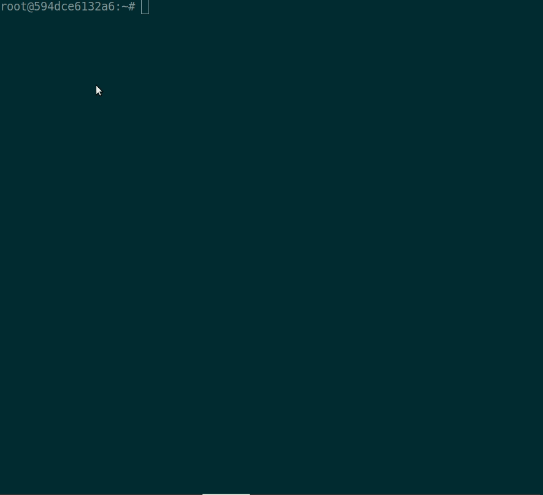

# ocli
[](https://circleci.com/gh/manahl/ocli)

An Oracle-DB command line client with auto-completion and syntax highlighting that emulates the functionality of [sqlplus](http://www.oracle.com/technetwork/developer-tools/sql-developer/overview/index.html).

## Installation
TODO

## Documentation
For documentation and config options see the [user guide](https://github.com/manahl/ocli/wiki/user-guide) or type ``help`` from within the app.

## Demo 



## Usage
```
Usage: ocli [OPTIONS] [SQLPLUS]

  An Oracle-DB terminal client with auto-completion and syntax highlighting.

  Examples:
    - ocli -u my_user -h my_host.com -D schema
    - ocli user/password@tns_name 
    - ocli user/password@tns_name -D schema 
    - ocli user/password@tns_name -e "query"
    - ocli user@tns_name -@ query_file.sql

Options:
  -h, --host TEXT         Host address of the database.
  -P, --port INTEGER      Port number to use for connection.
  -u, --user TEXT         User name to connect to the database.
  -p, --password TEXT     Password to connect to the database.
  -v, --version           Output ocli's version.
  -D, --database TEXT     Database to use.
  -R, --prompt TEXT       Prompt format (Default: "\t \u@\h:\d> ").
  -l, --logfile FILENAME  Log every query and its results to a file.
  --oclirc PATH         Location of oclirc file.
  --auto-vertical-output  Automatically switch to vertical output mode if the
                          result is wider than the terminal width.
  -t, --table             Display batch output in table format.
  --csv                   Display batch output in CSV format.
  --warn / --no-warn      Warn before running a destructive query.
  --login-path TEXT       Read this path from the login file.
  -e, --execute TEXT      Execute command and quit.
  -@, --filename TEXT     Execute commands in a file.
  --help                  Show this message and exit.
```

### Thanks
Thanks to [mycli](https://github.com/dbcli/mycli). Most of the features (e.g. syntax highlighting, auto-complete) were implemented by the mycli core team for MySQL.
